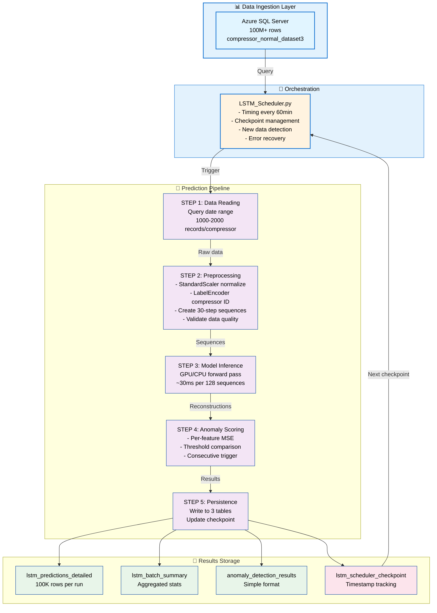

# LSTM_Autoencoder_detection
This project uses an LSTM Autoencoder to detect anomalies in time-series sensor data in Centrifugal Compressors.  The model is trained to reconstruct normal operating patterns — when the reconstruction error exceeds a learned threshold, the system flags an anomalous event.

A production-ready deep learning pipeline for real-time anomaly detection in industrial compressor systems using Compressor-Aware LSTM autoencoders.

## Overview Contents
* [Architecture](#Architecture)
* [Key Design Decisions](#KeyDesignDecisions)
* [Technical Challenges & Solutions](#technicalchallenges&solutions)
* [Installation](#installation)
* [Configuration](#Configuration)
* [Usage](#usage)
* [Pipeline Components](#pipelinecomponents)
* [Performance & Monitoring](#performance&monitoring)
* [Production Deployment](#productiondeployment)

## Introduction

This repository implements a Compressor-Aware LSTM Autoencoder system for detecting anomalies in industrial compressor operations. Unlike traditional anomaly detection approaches, this system:

Multi-device learning: Learns per-device anomaly patterns by conditioning the model on compressor identity
Per-device thresholds: Maintains device-specific anomaly thresholds for accurate detection across heterogeneous equipment
Production-grade pipeline: Designed for continuous operation in industrial IoT environments
Automated scheduling: Fully automated data ingestion, model inference, and results persistence

Core Problem
Industrial compressors exhibit unique behavioral patterns based on their operational history, configuration, and maintenance status. A single global anomaly threshold fails to capture these nuances, leading to:

High false positive rates on "normally operating but abnormal for this device" patterns
Missed true anomalies masked by device-specific variance
Inability to distinguish between equipment degradation and installation differences

Solution
The Compressor-Aware LSTM approach uses a selective multi-head decoder architecture where:

All compressors share a common encoder for efficient representation learning
Each compressor has a dedicated decoder head for device-specific reconstruction
A custom routing layer selects the appropriate decoder based on compressor ID
Per-device thresholds are calibrated during training using normal operation data

# Architecture
##### High-level System Design

### Model Architecture Details
    INPUT: (batch, 30, 11)
        ▼
    ┌──────────────────────────────────────────┐
    │ ENCODER - Shared                         │
    ├──────────────────────────────────────────┤
    │ • LSTM(64)  → (batch, 30, 64)            │
    │ • LSTM(32)  → (batch, 32)                │
    │ • Dense(16) → (batch, 16)                │
    └──────────────────────────────────────────┘
        ▼
    ┌──────────────────────────────────────────┐
    │ DECODER HEADS - Per-Compressor           │
    ├──────────────────────────────────────────┤
    │ For each compressor:                     │
    │ • RepeatVector(30) → (batch, 30, 16)     │
    │ • LSTM(32)  → (batch, 30, 32)            │
    │ • LSTM(64)  → (batch, 30, 64)            │
    │ • Dense(11) → (batch, 30, 11)            │
    └──────────────────────────────────────────┘
        ▼
    ┌──────────────────────────────────────────┐
    │ SELECTOR - Route by Compressor ID        │
    ├──────────────────────────────────────────┤
    │ SelectDecoderOutput (Custom Layer)       │
    └──────────────────────────────────────────┘
        ▼
    OUTPUT: (batch, 30, 11)

This custom layer enables:

Single forward pass without branching logic in training/inference
TensorFlow graph optimization and XLA compilation support
Model serialization/deserialization without Lambda layers

## Feature Engineering
### Input Features (11 total):
1. filter_dp - Filter differential pressure
2. seal_gas_flow - Seal gas volumetric flow
3. seal_gas_diff_pressure - Seal gas pressure differential
4. seal_gas_temp - Seal gas temperature
5. primary_vent_flow - Primary vent flow rate
6. primary_vent_pressure - Primary vent pressure
7. secondary_seal_gas_flow - Secondary seal flow
8. separation_seal_gas_flow - Separation gas flow
9. separation_seal_gas_pressure - Separation gas pressure
10. seal_gas_to_vent_diff_pressure - Gas-to-vent pressure differential
11. encoding - [One-hot or label encoded compressor ID]

Dimensionality:

Sequence length: 30 timesteps (15 minutes at 30-second intervals)
Total input shape: (batch_size, 30, 11)

# Key Design Decisions 

1. Compressor-Aware vs. Global Model

| Aspect | Global Model | Compressor-Aware |
|--------|:----------:|:----------:|
| Threshold | Single value | Per-device calibrated |
| False positives | High (device variance) | Low (learned variance) |
| Training time | Faster | Moderate (multi-decoder) |
| Deployment | Simple | Requires encoder mapping |
| New compressor | Retrain full model | Add new decoder + threshold |