# LSTM_Autoencoder_detection
This project uses an LSTM Autoencoder to detect anomalies in time-series sensor data in Centrifugal Compressors.  The model is trained to reconstruct normal operating patterns — when the reconstruction error exceeds a learned threshold, the system flags an anomalous event.

A production-ready deep learning pipeline for real-time anomaly detection in industrial compressor systems using Compressor-Aware LSTM autoencoders.

## Overview Contents
* [Architecture](#Architecture)
* [Key Design Decisions](#Key-Design-Decisions)
* [Technical Challenges & Solutions](#Technical-Challenges-and-Solutions)

* [Usage](#usage)
* [Pipeline Components](#pipeline-components)
* [Performance & Monitoring](#performance-and-monitoring)
* [Production Deployment](#production-deployment)

## Introduction

This repository implements a Compressor-Aware LSTM Autoencoder system for detecting anomalies in industrial compressor operations. Unlike traditional anomaly detection approaches, this system:

Multi-device learning: Learns per-device anomaly patterns by conditioning the model on compressor identity
Per-device thresholds: Maintains device-specific anomaly thresholds for accurate detection across heterogeneous equipment
Production-grade pipeline: Designed for continuous operation in industrial IoT environments
Automated scheduling: Fully automated data ingestion, model inference, and results persistence

Core Problem
Industrial compressors exhibit unique behavioral patterns based on their operational history, configuration, and maintenance status. A single global anomaly threshold fails to capture these nuances, leading to:

High false positive rates on "normally operating but abnormal for this device" patterns
Missed true anomalies masked by device-specific variance
Inability to distinguish between equipment degradation and installation differences

Solution
The Compressor-Aware LSTM approach uses a selective multi-head decoder architecture where:

All compressors share a common encoder for efficient representation learning
Each compressor has a dedicated decoder head for device-specific reconstruction
A custom routing layer selects the appropriate decoder based on compressor ID
Per-device thresholds are calibrated during training using normal operation data

# Architecture
##### High-level System Design

```mermaid
graph TB
    subgraph DataLayer["📊 Data Ingestion Layer"]
        DB["Azure SQL Server<br/>100M+ rows<br/>compressor_normal_dataset3"]
    end
    style DataLayer fill:#e3f2fd,stroke:#1976d2,stroke-width:2px,color:#000
    style DB fill:#e3f2fd,stroke:#1976d2,stroke-width:2px,color:#000

    
    subgraph Orchestration["🎯 Orchestration"]
        SCHEDULER["LSTM_Scheduler.py<br/>- Timing every 60min<br/>- Checkpoint management<br/>- New data detection<br/>- Error recovery"]
    end
    style Orchestration fill:#e3f2fd,stroke:#1976d2,stroke-width:1px,color:#000
    style SCHEDULER fill:#e3f2fd,stroke:#1976d2,stroke-width:2px,color:#000
    
    subgraph Pipeline["🔄 Prediction Pipeline"]
        STEP1["STEP 1: Data Reading<br/>Query date range<br/>1000-2000 records/compressor"]
        STEP2["STEP 2: Preprocessing<br/>- StandardScaler normalize<br/>- LabelEncoder compressor ID<br/>- Create 30-step sequences<br/>- Validate data quality"]
        STEP3["STEP 3: Model Inference<br/>GPU/CPU forward pass<br/>~30ms per 128 sequences"]
        STEP4["STEP 4: Anomaly Scoring<br/>- Per-feature MSE<br/>- Threshold comparison<br/>- Consecutive trigger"]
        STEP5["STEP 5: Persistence<br/>Write to 3 tables<br/>Update checkpoint"]
    end
    classDef nodestyle fill:#e3f2fd,stroke:#0d47a1,color:#000
    class STEP1,STEP2,STEP3,STEP4,STEP5 nodestyle
    
    subgraph Results["💾 Results Storage"]
        TABLE1["lstm_predictions_detailed<br/>100K rows per run"]
        TABLE2["lstm_batch_summary<br/>Aggregated stats"]
        TABLE3["anomaly_detection_results<br/>Simple format"]
        CHECKPOINT["lstm_scheduler_checkpoint<br/>Timestamp tracking"]
    end
    class TABLE1,TABLE2,TABLE3,CHECKPOINT nodestyle

    
    DB -->|Query| SCHEDULER
    SCHEDULER -->|Trigger| STEP1
    STEP1 -->|Raw data| STEP2
    STEP2 -->|Sequences| STEP3
    STEP3 -->|Reconstructions| STEP4
    STEP4 -->|Results| STEP5
    STEP5 --> TABLE1 & TABLE2 & TABLE3 & CHECKPOINT
    CHECKPOINT -->|Next checkpoint| SCHEDULER
    
    style DB fill:#e1f5ff
    style SCHEDULER fill:#fff3e0
    style STEP1 fill:#f3e5f5
    style STEP2 fill:#f3e5f5
    style STEP3 fill:#f3e5f5
    style STEP4 fill:#f3e5f5
    style STEP5 fill:#f3e5f5
    style TABLE1 fill:#e8f5e9
    style TABLE2 fill:#e8f5e9
    style TABLE3 fill:#e8f5e9
    style CHECKPOINT fill:#fce4ec


```


### Model Architecture Details
    INPUT: (batch, 30, 11)
        ▼
    ┌──────────────────────────────────────────┐
    │ ENCODER - Shared                         │
    ├──────────────────────────────────────────┤
    │ • LSTM(64)  → (batch, 30, 64)            │
    │ • LSTM(32)  → (batch, 32)                │
    │ • Dense(16) → (batch, 16)                │
    └──────────────────────────────────────────┘
        ▼
    ┌──────────────────────────────────────────┐
    │ DECODER HEADS - Per-Compressor           │
    ├──────────────────────────────────────────┤
    │ For each compressor:                     │
    │ • RepeatVector(30) → (batch, 30, 16)     │
    │ • LSTM(32)  → (batch, 30, 32)            │
    │ • LSTM(64)  → (batch, 30, 64)            │
    │ • Dense(11) → (batch, 30, 11)            │
    └──────────────────────────────────────────┘
        ▼
    ┌──────────────────────────────────────────┐
    │ SELECTOR - Route by Compressor ID        │
    ├──────────────────────────────────────────┤
    │ SelectDecoderOutput (Custom Layer)       │
    └──────────────────────────────────────────┘
        ▼
    OUTPUT: (batch, 30, 11)


### Key Layer: SelectDecoderoutput
~~~ python
class SelectDecoderOutput(Layer):
    """
    Routes decoder outputs based on compressor ID.
    
    Input: [decoder_out_0, decoder_out_1, ..., decoder_out_N, compressor_ids]
    - Stack all decoder outputs: shape (batch_size, num_compressors, seq_len, features)
    - Use compressor_ids to gather correct output: shape (batch_size, seq_len, features)
    """
~~~

This custom layer enables:

Single forward pass without branching logic in training/inference
TensorFlow graph optimization and XLA compilation support
Model serialization/deserialization without Lambda layers

## Feature Engineering
### Input Features (11 total):
1. filter_dp - Filter differential pressure
2. seal_gas_flow - Seal gas volumetric flow
3. seal_gas_diff_pressure - Seal gas pressure differential
4. seal_gas_temp - Seal gas temperature
5. primary_vent_flow - Primary vent flow rate
6. primary_vent_pressure - Primary vent pressure
7. secondary_seal_gas_flow - Secondary seal flow
8. separation_seal_gas_flow - Separation gas flow
9. separation_seal_gas_pressure - Separation gas pressure
10. seal_gas_to_vent_diff_pressure - Gas-to-vent pressure differential
11. encoding - [One-hot or label encoded compressor ID]

**Dimensionality:**

Sequence length: 30 timesteps (15 minutes at 30-second intervals)
Total input shape: (batch_size, 30, 11)


## Key Design Decisions 

**1. Compressor-Aware vs. Global Model**

| Aspect | Global Model | Compressor-Aware |
|--------|:----------:|:----------:|
| Threshold | Single value | Per-device calibrated |
| False positives | High (device variance) | Low (learned variance) |
| Training time | Faster | Moderate (multi-decoder) |
| Deployment | Simple | Requires encoder mapping |
| New compressor | Retrain full model | Add new decoder + threshold |

Decision: Compressor-aware architecture provides better accuracy and flexibility for heterogeneous industrial sites.

**2. SelectDecoderOutput vs. Lambda Layer**
Problem: Lambda layers in Keras/TensorFlow cause serialization issues

```python
# ❌ DON'T USE - Cannot save/load
decoder_output = Lambda(lambda x: custom_routing(x))(...)

# ✅ USE - Full serialization support
decoder_output = SelectDecoderOutput()(...)
```
**Solution**: Custom Keras layer with get_config() and from_config() enables:

Full model save/load without loss
Production deployment without code dependencies
Distributed inference support

**3. Checkpoint-Based Streaming**
Challenge: Azure SQL Server contains 100M+ rows per compressor. Reprocessing all data is inefficient.
Solution: Timestamp-based checkpoint system

This enables:

Cost efficiency: No redundant SQL queries or model inference
Real-time capability: 2-hour sliding window captures recent anomalies
Resilience: Failed runs restart from last successful checkpoint
Scalability: O(n) complexity independent of historical data size.

**4. Consecutive Anomaly Filtering**
Single anomaly points often represent sensor noise or transient events.
```python
# Trigger anomaly event only when:
consecutive_threshold = 3  # 90 seconds of continuous anomaly
# This reduces false alerts while preserving true anomalies
```
This provides:

Noise robustness without tuning threshold too conservatively
Configurable sensitivity (adjust consecutive_threshold parameter)
Balance between sensitivity and specificity.

**5. Per-Feature MSE Scoring**
```python
# For each sequence:
reconstruction_error = mean((predicted - actual)²)

# Comparison:
is_anomaly = reconstruction_error > per_compressor_threshold
```

Why MSE?

Emphasizes larger deviations (physically significant in most sensors)
Scale-invariant (StandardScaler normalizes all features to [0,1])
Differentiable for potential future model updates
Computationally efficient (single matrix operation)

## Technical Challenges and Solutions

**Challenge 1: Multi-Compressor Model Serialization**

Model has multiple decoder heads - standard Keras serialization fails
Cannot properly route outputs based on compressor ID.

Solution:
```python
class SelectDecoderOutput(keras.Layer):
    """Custom layer that's fully serializable"""
    
    def get_config(self):
        return super().get_config()
    
    @classmethod
    def from_config(cls, config):
        return cls(**config)

# Load with custom_objects
model = keras.models.load_model(
    path,
    custom_objects={'SelectDecoderOutput': SelectDecoderOutput},
    compile=False
)
```
Key learnings:

Avoid Lambda layers in production models.
Always implement get_config() + from_config() for custom layers
Compile separately after loading to handle metric changes across TensorFlow versions.

**Challenge 2: Real-Time Inference Performance**

Problem: Batch size 1 inference = 200ms per sample (slow)
Need sub-100ms latency for real-time monitoring.One of the ways to handle this is to implement micro-batching. Below is teh micro batching codes for reduction in memory overhead. 
```python
# Accumulate predictions
sequences = []
compressor_ids = []

for i in range(0, len(data), batch_size=128):
    batch = data[i:i+128]
    sequences.extend(batch.sequences)
    compressor_ids.extend(batch.compressor_ids)

# Single inference pass
predictions = model.predict(
    [np.array(sequences), np.array(compressor_ids)],
    batch_size=128,
    verbose=0
)
# 128 samples in ~50ms (GPU) or ~150ms (CPU)
```
**Results**:

Batch 1: 200ms → Batch 128: 50ms = 4x speedup

Memory overhead: ~50MB (acceptable)

Throughput: 2,560 predictions/second

**Challenge 3: Per-Device Threshold Calibration**

Different compressors have different "normal" reconstruction errors
- Newly commissioned compressor: error = 0.02
- Aged compressor: error = 0.08
- Using single threshold misses anomalies in aged units

We use Per compressor thrshold learning to differentiate compressors' operating baseline. 
```python
# During training on normal operation data:
for compressor_id in training_compressors:
    errors = model.predict_on_normal_data(compressor_id)
    # Threshold = mean + 2*std (captures 95th percentile)
    threshold = np.mean(errors) + 2.0 * np.std(errors)
    thresholds[compressor_id] = threshold

# Save thresholds
joblib.dump(thresholds, 'thresholds.pkl')

# Load for inference
thresholds = joblib.load('thresholds.pkl')
is_anomaly = reconstruction_error > thresholds[compressor_id]
```
**Advantages:**

* Each device gets calibrated sensitivity
* New compressors: add decoder head + compute threshold from baseline
* Threshold evolution: retrain periodically with updated training data

**Challenge 4: Scheduler Reliability & Restartability**

Process crashes mid-run → Data partially written → Inconsistent state.
How do we resume without skipping records or reprocessing? The answer lies in implementation of class LSTMScheduler (Atomic Checkpoint Management): 
```python
class LSTMScheduler:
    def load_last_processed_time(self):
        """Load checkpoint from persistent storage"""
        checkpoint_file = Path("lstm_scheduler_checkpoint.txt")
        if checkpoint_file.exists():
            with open(checkpoint_file, 'r') as f:
                self.last_processed_time = datetime.fromisoformat(f.read().strip())
        else:
            # First run: start from lookback window
            self.last_processed_time = datetime.now() - timedelta(hours=2)
    
    def save_last_processed_time(self, timestamp):
        """Atomically save new checkpoint"""
        checkpoint_file = Path("lstm_scheduler_checkpoint.txt")
        with open(checkpoint_file, 'w') as f:
            f.write(timestamp.isoformat())
        # File written = pipeline succeeded
```
**Key invariant:** Checkpoint is updated only after successful database write

Crash before write? → Restart from previous checkpoint (reprocess, but no data loss)
Crash after write? → Checkpoint updated → Resume from new position

This provides exactly-once or at-least-once semantics depending on use case.

## Usage
**1. Standalone Pipeline Execution**
```python
from LSTM_Prediction_pipeline_compaware import CompressorAwareLSTMPredictionPipeline
from datetime import datetime, timedelta

# Initialize
pipeline = CompressorAwareLSTMPredictionPipeline(
    connection_string="DRIVER={ODBC Driver 18 for SQL Server};SERVER=...;",
    model_path="models/compressor_aware_model_no_lambda2.h5",
    scaler_path="models/feature_scaler_no_lambda2.pkl",
    encoder_path="models/compressor_encoder_no_lambda2.pkl",
    thresholds_path="models/thresholds_no_lambda2.pkl"
)

# Run on specific date range
start_date = datetime.now() - timedelta(days=1)
end_date = datetime.now()

batch_id = pipeline.run_pipeline(
    start_date=start_date,
    end_date=end_date,
    consecutive_threshold=3,
    source_table="compressor_normal_dataset3"
)

print(f"Completed batch: {batch_id}")
pipeline.close()
```
**2. Automated Schdeduling**
```python
# Run scheduler (processes every hour)
python LSTM_Scheduler.py --interval 60 --min-records 100

# Run every 30 minutes
python LSTM_Scheduler.py --interval 30 --min-records 50

# Custom settings
python LSTM_Scheduler.py --interval 120 --min-records 200
```
Scheduler behavior:

* ✓ Loads checkpoint: lstm_scheduler_checkpoint.txt
* ✓ Checks for new data since last checkpoint
* ✓ Runs pipeline if new_records >= min_new_records
* ✓ Updates checkpoint atomically after success
* ✓ Logs all operations: lstm_scheduler.log

**3. Retrieve Recent Results** 
```python
# Get recent batch summaries
recent_batches = pipeline.db_writer.get_recent_batches(limit=5)
print(recent_batches)

# Query specific batch
batch_id = "550e8400-e29b-41d4-a716-446655440000"
results = pipeline.db_writer.get_batch_results(batch_id)
print(f"Batch {batch_id}: {len(results)} predictions")
```

## Pipeline Components
**1. LSTM_Prediction_pipeline_compaware.py**
Responsibilities:

* Load model, scaler, encoder, thresholds
* Read data from Azure SQL Server with date filtering
* Preprocess sequences (normalize, validate, encode)
* Run inference on GPU/CPU
* Calculate per-compressor anomaly scores
* Write results to 3 database tables
Support per-compressor and date-range filtering

```python
pipeline = CompressorAwareLSTMPredictionPipeline(...)

# Read raw data
df = pipeline.read_data_from_db(start_date, end_date, compressor_id)

# Prepare sequences
sequences, compressor_ids, metadata = pipeline.preprocess_data(df)

# Inference
reconstructions = pipeline.make_predictions(sequences, compressor_ids)

# Score anomalies
results_df = pipeline.calculate_anomaly_scores(
    sequences, reconstructions, metadata, consecutive_threshold=3
)

# Persist
pipeline.run_pipeline(start_date, end_date, consecutive_threshold=3)
```
**2. LSTM_Scheduler.py**

**Responsibilities:**

* Manage timing (run every N minutes)
* Track last processed timestamp (checkpoint)
* Check for new data availability
* Trigger pipeline when conditions met
* Handle process crashes gracefully
* Provide comprehensive logging

**Configuration:**
```python
scheduler = LSTMScheduler(
    connection_string="...",
    model_path="models/...",
    scaler_path="models/...",
    encoder_path="models/...",
    thresholds_path="models/...",
    source_table="compressor_normal_dataset3",
    min_new_records=100,      # Only run if 100+ new rows
    lookback_hours=2           # Check last 2 hours
)

# Schedule every hour
schedule.every().hour.at(":00").do(scheduler.run_pipeline)

# Run forever
scheduler.run_scheduled()
```

**3. LSTM_Database_writer2.py**

Responsibilities (referenced but not included):

* Manage database write operations
* Batch insert for performance
* Handle connection errors with retry
* Support 3 output tables (detailed, summary, simple)

## Performance and Monitoring   
**Latency Metrics** (Typical per run per day):
```python
Data reading:           5-10 seconds   (SQL query, network)
Preprocessing:          2-3 seconds    (scaling, windowing)
Inference:              15-30 seconds  (128-sample batches)
Anomaly scoring:        3-5 seconds    (MSE calculation)
Database writing:       10-20 seconds  (batch inserts)
─────────────────────────────────────
Total:                  35-68 seconds per run
```

Throughput:

* Inference: 2,500-3,000 predictions/second (GPU) or 800-1,000 (CPU)
* Database write: 5,000-10,000 rows/second

**Snippet of the monitoring logs**
```python
2024-11-11 10:00:00 - INFO - ✓ LSTM SCHEDULER INITIALIZED
2024-11-11 10:00:00 - INFO - ✓ Running initial check...
2024-11-11 10:00:05 - INFO - 🔍 Data check: 1,250 new records found
2024-11-11 10:00:05 - INFO - ✓ Processing 1,250 new records...
2024-11-11 10:00:10 - INFO - ✓ Model loaded and recompiled
2024-11-11 10:00:12 - INFO - ✓ Preprocessing completed: 1,200 sequences
2024-11-11 10:00:28 - INFO - ✓ Predictions completed
2024-11-11 10:00:31 - INFO - 📊 Anomaly Results:
2024-11-11 10:00:31 - INFO -    Total sequences: 1,200
2024-11-11 10:00:31 - INFO -    Anomaly points: 45 (3.75%)
2024-11-11 10:00:31 - INFO -    Triggered anomalies: 8 (0.67%)
2024-11-11 10:00:40 - INFO - ✓ PIPELINE COMPLETED SUCCESSFULLY
2024-11-11 10:00:40 - INFO - 📋 Batch ID: 550e8400-e29b-41d4-a716-446655440000
2024-11-11 11:00:00 - INFO - (repeats every hour)
```
Typical Distrubution:
```python
Total predictions:    50,000 per day
Anomaly points (>threshold):  1,500 (3%)
Triggered events (3+ consecutive):  45 (0.09%)

Compressor-A  │ ████ (85 events/month)    Normal aging pattern
Compressor-B  │ ██ (25 events/month)      Recently maintained
Compressor-C  │ ███████ (200 events/month) Requires inspection
```
## Production Deployment
**1. On Windows Task Scheduler - using batch script**
```python
# Create scheduled task (run as admin)
schtasks /create /tn "LSTM-Anomaly-Detection" /tr "C:\path\to\venv\Scripts\python LSTM_Scheduler.py" /sc HOURLY /f
```
Advanatage is that there's no external dependencies, built-in monitoring

Disadvantages: Windows-only, limited logging

**2. Docker container deployment**
```python
docker build -t lstm-anomaly:v1.0 .
docker run -d --gpus all --name lstm-scheduler lstm-anomaly:v1.0
```
**3. On Azure deployment (serverless)**
```python
# Azure Function runtime
import azure.functions as func
from LSTM_Scheduler import setup_custom_schedule

def main(timer: func.TimerRequest):
    if timer.past_due:
        func.logging.info('Execution delayed')
    
    scheduler = setup_custom_schedule(interval_minutes=60)
    scheduler.run_pipeline()
    
    func.logging.info('Pipeline completed')
```


**References & Further Reading**

LSTM Autoencoders for Anomaly Detection:
* https://arxiv.org/abs/1607.00148
* Multi-task Learning: https://arxiv.org/abs/1707.08114
* TensorFlow Custom Layers: https://www.tensorflow.org/guide/keras/functional
* Azure SQL Server Performance: https://docs.microsoft.com/en-us/azure/azure-sql/database/performance-guidance